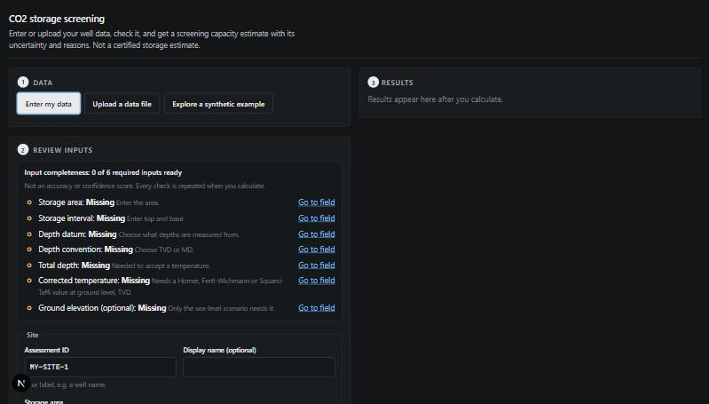
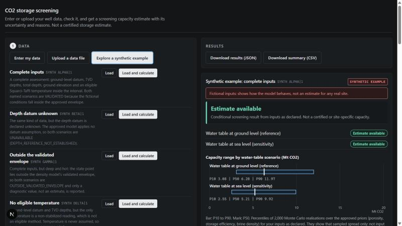
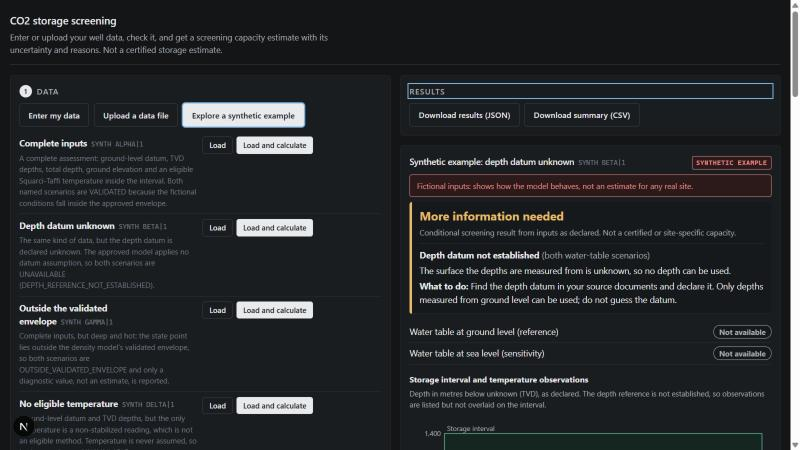
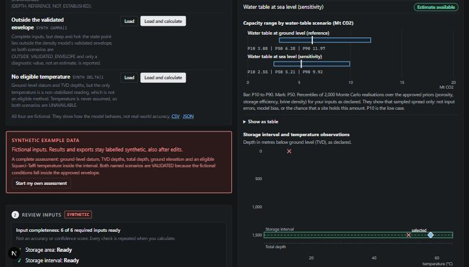
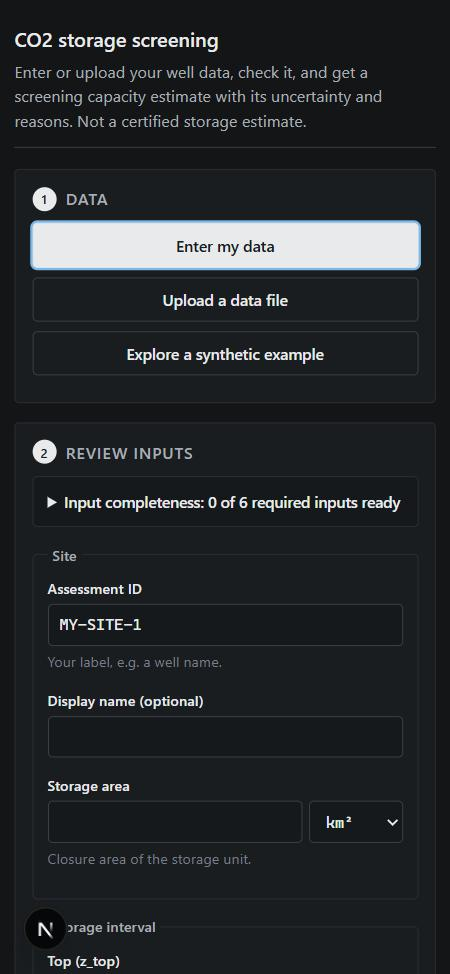
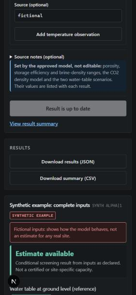

# PoreLedger CCS

**CO2 Storage Screening & Uncertainty Analysis - by Iman Saghafifar ([imansgh.me](https://imansgh.me))**

Research software for conditional screening of geological CO2 storage: a
Python/FastAPI calculation service and a Next.js website. You declare the
inputs, the model's fixed priors and assumptions are shown with every result,
and runs are reproducible (fixed seed, exported inputs and settings).

**Version:** 0.2.0 (release candidate; no public release is claimed).

| Component | Current status |
| --- | --- |
| Assessment engine and local interface | Implemented and tested; run locally using the quick start below |
| Portfolio page | Prepared in Lovable preview at `/poreledger-ccs`; not published on imansgh.me |
| Hosted interactive demo | Not active; HTTPS backend and static hosting still need deployment and end-to-end verification |
| Public repository | `imansgh/poreledger-ccs` is the intended publication destination, not a verified public release |

See [release notes](CHANGELOG.md), [publication guide](docs/public-release.md)
and [release decisions](docs/release-decisions.md). The personal website link
above is the author's portfolio, not a running calculation service.

Screen a geological CO2 storage site **with your own data**. Enter or upload a
well or site description -- storage area, the storage-assessment interval and
its depth reference, temperature observations -- and the approved screening
model returns a scenario-based capacity estimate with its uncertainty,
assumptions and provenance, or explains exactly why it cannot.

> **Status: research software.** Results are conditional screening estimates
> under stated assumptions, never certified or site-specific storage
> capacities. Inputs are used as you declare them and are not independently
> verified.

## What it computes, and what it does not assess

**Computes** the approved model of the owner-approved Model Contract
([docs/phase13-owner-decision-record.md](docs/phase13-owner-decision-record.md)):

```
M = A * h_g * phi * rho_CO2(P_EOS, T) * E
P_EOS = 101325 Pa + rho_brine * g * (z_state - z_wl)
```

- `A` (area) and the interval `z_top`-`z_base` come from you; `h_g = z_base - z_top`
  and `z_state = (z_top + z_base)/2` are derived.
- `T` is selected from your temperature observations by the contract's rule
  (corrected methods only, inside the interval, ground-level TVD depths, not
  below total depth). It is never assumed. Supply already-corrected observations; the tool does not
  correct raw logged temperatures.
- Pressure is hydrostatic under two named water-level scenarios,
  `GROUND_REFERENCE` (`z_wl = 0`) and `SEA_LEVEL_SENSITIVITY` (`z_wl` = ground
  elevation above sea level).
- CO2 density is Peng-Robinson with a Peneloux shift, validated against Span &
  Wagner over 1-35 MPa and 280-400 K.
- Porosity U(0.10, 0.35), storage efficiency U(0.01, 0.04) and brine density
  U(1020, 1100) kg/m3 are the approved priors; a Monte Carlo gives P10/P50/P90.
  These priors cannot be overridden. The ranges reflect sampling of these
  model priors, not uncertainty in every user-entered measurement.

**Does not assess:** whether your inputs are correct; reservoir quality,
injectivity, containment, caprock integrity, pressure management or
regulatory suitability; two-phase flow, trapping or geomechanics. It is not a
reservoir simulator.

## Quick start (fresh checkout, no datasets needed)

Python 3.10+ and Node.js 20+.

```bash
python -m pip install -e ".[dev,web]"
python scripts/serve.py --no-dataset --cors-origin http://localhost:3000
```

In a second terminal:

```bash
cd frontend
npm ci
npm run dev
```

Open **http://localhost:3000** (exactly this origin: CORS allows only what you
named). Then choose **Enter my data**, **Upload a data file**, or **Explore a
synthetic example**. Use `--demo` instead of `--no-dataset` to also load the
fictional demo wells into the optional existing-data section.

Without a browser: `python scripts/run_public_demo.py` prints the synthetic
outcomes, and `curl` works against the API:

```bash
curl -s -X POST http://127.0.0.1:8000/assessments/evaluate \
  -H 'Content-Type: application/json' \
  -d '{"document": {"schema_version": "ccs-assessment/1", "assessments": [{"id": "MY-SITE-1", "storage_area": {"value": 20, "unit": "km2"}, "storage_interval": {"top": 1450, "base": 1550, "unit": "m"}, "depth_reference": {"datum": "ground_level", "convention": "TVD"}, "total_depth": {"value": 1650, "unit": "m"}, "surface_elevation": {"value": 240, "unit": "m", "reference": "msl"}, "temperature_observations": [{"value": 58, "unit": "degC", "depth": 1500, "depth_unit": "m", "depth_datum": "ground_level", "depth_convention": "TVD", "method": "extrapolated_squarci_taffi"}]}]}}'
```

With Docker: `docker compose up --build` (see [docs/deployment.md](docs/deployment.md);
the container setup has not been built in the environment where it was written).

| Input workflow | Valid result | Unavailable result |
| --- | --- | --- |
|  |  |  |

| Charts | Phone: inputs first | Phone: result |
| --- | --- | --- |
|  |  |  |

## The workflow

The page opens on the work itself: inputs on the left, results on the right
(stacked on a phone, inputs first).

1. **Data.** Type into the form that is already open, upload a JSON or CSV
   file (`ccs-assessment/1`; one CSV can hold many assessments), or pick a
   synthetic example and "Load and calculate" it in one click. Replacing
   inputs you have edited asks first. Templates:
   [CSV](src/ccs_screen/assessment_data/assessment-template.csv),
   [JSON](src/ccs_screen/assessment_data/assessment-template.json).
2. **Review inputs.** Units sit next to every value. An *input completeness*
   checklist (not an accuracy score) links to anything missing or
   unsupported. Import and validation problems appear beside the field, with
   CSV row numbers; a partial or conflicting CSV import blocks calculation until a corrected
   file is uploaded or a fresh assessment is started. Editing a partial preview
   does not remove that block. Model-controlled
   assumptions are marked as such.
3. **Calculate.** The backend's approved engine evaluates the assessment, the
   same code path as every other well. The button shows progress, and is
   disabled while the result is current; editing an input marks the result
   *outdated* and disables its exports.
4. **Understand.** A headline outcome, each distinct blocking reason once
   (naming the water-table scenarios it affects) with what to do, the status
   of both scenarios, a capacity-range chart (P10-P90 with P50, VALIDATED
   scenarios only, never plotted as zero) and a depth-temperature view of your
   interval and observations (selected, eligible and excluded marked by
   symbol; nothing interpolated; not overlaid when depth references differ).
   Every chart has a table alternative. Inputs and provenance, calculation
   steps, priors and references, limitations and the exact diagnostic codes
   are in expandable sections. Download the full JSON result or a CSV summary.

The input contract, units, conventions, CSV layout and limits:
[docs/assessment-input-schema.md](docs/assessment-input-schema.md).

### Synthetic examples

Four **fictional** examples ([JSON](src/ccs_screen/assessment_data/synthetic-examples.json),
[CSV](src/ccs_screen/assessment_data/synthetic-examples.csv)) show each
outcome. "Load example" fills the same form; a synthetic notice stays visible,
results and exports are labelled `SYNTHETIC`, and editing an example does not
remove that label. "Start my own assessment" clears it.

| Example | Demonstrates | Outcome |
| --- | --- | --- |
| `SYNTH ALPHA\|1` | complete inputs | `VALIDATED` (both scenarios) |
| `SYNTH BETA\|1` | depth datum unknown | `UNAVAILABLE` (`DEPTH_REFERENCE_NOT_ESTABLISHED`) |
| `SYNTH GAMMA\|1` | deep and hot | `OUTSIDE_VALIDATED_ENVELOPE` (diagnostic value only) |
| `SYNTH DELTA\|1` | only a non-stabilized temperature | `UNAVAILABLE` (no eligible temperature) |

The examples demonstrate the workflow and the model's behaviour. They do not
show real-world accuracy.

## Reading a result

| Status | Meaning |
| --- | --- |
| `VALIDATED` | The approved calculation ran and every sampled state fell inside the density model's validated range. A conditional screening estimate is reported. |
| `OUTSIDE_VALIDATED_ENVELOPE` | The calculation ran, but conditions fall outside that range. At most a diagnostic value is shown; it is not an estimate. |
| `UNAVAILABLE` | A required input is missing, unsupported or not established (unknown datum, MD depths, no eligible temperature, no total depth). No number is produced. |
| `NOT_VALIDATED` | A legacy placeholder path, kept for comparison (existing-data section only). |

**`VALIDATED` means the approved calculation meets its specified validation
conditions. It does not certify your input data, the reservoir's suitability,
or the actual storage capacity.** The interface keeps three things separate:
*calculation implemented and checked* (see validation evidence),
*model validity* (the status), and *input-data quality* (not assessed).

## Scientific integrity

- The Model Contract is unchanged. User data runs through the same engine as
  every existing well; nothing scientific is computed in the browser.
- For user assessments, only ground-level depths in TVD are evaluated. Other datums, MD and unknown
  conventions give `UNAVAILABLE`; nothing is converted or relabelled. The MD/TVD
  gate and the treatment of declared datums are recorded, with evidence, as
  interpretations awaiting owner confirmation in
  [docs/scientific-notes.md](docs/scientific-notes.md).
- Evidence for the calculations -- an AST-isolated independent
  re-implementation, a density comparison with Span & Wagner over the whole
  validated envelope (mean 3.8 %, max 13.6 %), an independent Monte Carlo
  check of the user path -- and its limits:
  [docs/validation-evidence.md](docs/validation-evidence.md).

## Your data

Submitted assessment values are processed in memory, not persisted or added
to any dataset; the application does not log request bodies. Hosting providers
may have their own infrastructure logs; files are parsed as data, never executed. Details:
[docs/data-handling.md](docs/data-handling.md).

## Existing well data (optional)

The project also ingests structured Italian well sources (not distributed with
the repository). That workflow is optional, collapsed on the website, and
served only when a dataset is configured:

```bash
python -m pip install -e ".[dev,web,ingest]"
python scripts/serve.py --data-dir data --cors-origin http://localhost:3000
```

All 46 real wells ingested so far have an unknown depth datum, so their
approved results are `UNAVAILABLE`, as the contract requires. See
[docs/ingestion.md](docs/ingestion.md) and [demo/README.md](demo/README.md).

## API

`/assessments/*` for user data; `/health` (liveness), `/ready` (engine
readiness, independent of any dataset) and `/ready/existing-data` (optional
dataset); `/wells/*` for existing data. Reference: [docs/http-api.md](docs/http-api.md).

## Tests

```bash
python -m pytest -q
CCS_REQUIRE_REFERENCE_TESTS=1 python -m pytest tests/test_independent_calculation_audit.py tests/test_properties_audit.py tests/test_properties.py tests/test_assessment.py   # install CoolProp first
cd frontend
npm test && npm run typecheck && npm run build
npm run test:assessment      # user workflow against a real backend with no dataset
npm run test:demo            # existing-data section on the synthetic demo wells
```

The included CI workflow is configured to run these checks on pushes and pull requests, including the CoolProp reference checks in
strict mode (a missing CoolProp fails, it does not skip). The
[CoolProp](http://www.coolprop.org/) checks are a test-time reference only;
the package does not depend on it.

## Deployment

FastAPI backend plus a Next.js website that calls it from the browser. Key
points ([docs/deployment.md](docs/deployment.md)): `NEXT_PUBLIC_CCS_API_URL`
is compiled in at build time (`npm run build:static` requires HTTPS and
rejects any loopback URL in the bundle); `CCS_CORS_ORIGINS` must list the
website's exact origin; route traffic on `/ready`; no dataset or persistent
storage is needed for user assessments. There is no authentication; a public
single-process deployment turns on the built-in per-client rate limit and
evaluation concurrency cap ([deploy/public-demo.env](deploy/public-demo.env)).

## Contributing, documentation, license

- [CONTRIBUTING.md](CONTRIBUTING.md) -- setup, checks, rules for scientific changes.
- [docs/data-contribution.md](docs/data-contribution.md) -- contributing real well data.
- [docs/README.md](docs/README.md) -- documentation index (essential vs historical records).
- **License: [MIT](LICENSE)** for this repository's code and documentation.
  It grants no rights to external datasets, well reports or publications
  that the project cites or that users supply; the real well sources used
  during development are not distributed. Decisions:
  [docs/release-decisions.md](docs/release-decisions.md).

## Citation

If you use PoreLedger CCS in research, cite the repository and the exact
version or commit you ran, and report results as conditional screening
estimates under the stated priors (see "Reading a result").

## Repository layout

```
src/ccs_screen/            engine: approved_model, properties, capacity, monte_carlo, api
src/ccs_screen/assessment.py   user assessments: parse, validate, normalize, evaluate, export
src/ccs_screen/assessment_data/   templates and synthetic examples (packaged)
src/ccs_screen/ingest/     optional existing-data ingestion and the demo-well loader
src/ccs_screen/web/        FastAPI app
frontend/                  Next.js website and tests
demo/                      fictional demo wells for the optional existing-data section
scripts/                   serve.py, run_public_demo.py, fixture builders
deploy/                    Dockerfiles, public-demo backend environment
docs/                      contract, schema, evidence, API, deployment, records
```
